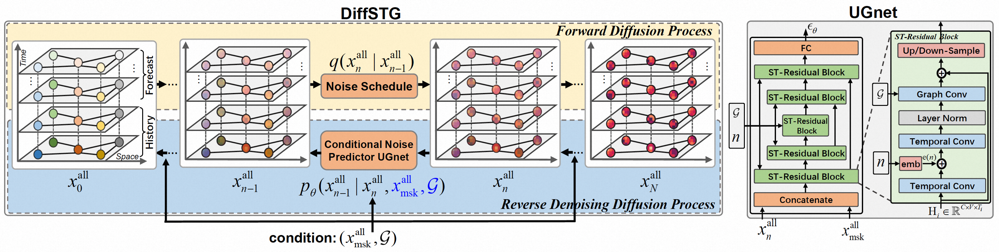

## (SIGSPATIAL 2023) DiffSTG: Probabilistic Spatio-Temporal Graph Forecasting with Denoising Diffusion Models

This code is a PyTorch implementation of our SIGSPATIAL'23 paper "DiffSTG: Probabilistic Spatio-Temporal Graph Forecasting with Denoising Diffusion Models". [[arXiv]](https://arxiv.org/abs/2301.13629)

## Citing DiffSTG
🌟 If you find this resource helpful, please consider to star this repository and cite our research:
```shell
@inproceedings{wen2023diffstg,
  title={{DiffSTG}: Probabilistic spatio-temporal graph forecasting with denoising diffusion models},
  author={Wen, Haomin and Lin, Youfang and Xia, Yutong and Wan, Huaiyu and Wen, Qingsong and Zimmermann, Roger and Liang, Yuxuan},
  booktitle={the 31st ACM International Conference on Advances in Geographic Information Systems},
  year={2023}
}
```


## Model Architecture


## Run

1. requirements:
```shell
torch
easydict
nni
```

2. start training
```shell
python train.py
```


## Further Reading
**1, Diffusion Model for Time Series and SpatioTemporal Data** 
[\[GitHub Repo\]](https://github.com/yyysjz1997/Awesome-TimeSeries-SpatioTemporal-Diffusion-Model)

**2, Large Models for Time Series and Spatio-Temporal Data: A Survey and Outlook** 
[\[arXiv\]](https://arxiv.org/abs/2310.10196)  [\[GitHub Repo\]](https://github.com/qingsongedu/Awesome-TimeSeries-SpatioTemporal-LM-LLM)

- **Authors**: Ming Jin, Qingsong Wen*, Yuxuan Liang, Chaoli Zhang, Siqiao Xue, Xue Wang, James Zhang, Yi Wang, Haifeng Chen, Xiaoli Li (IEEE Fellow), Shirui Pan*, Vincent S. Tseng (IEEE Fellow), Yu Zheng (IEEE Fellow), Lei Chen (IEEE Fellow), Hui Xiong (IEEE Fellow)

 
